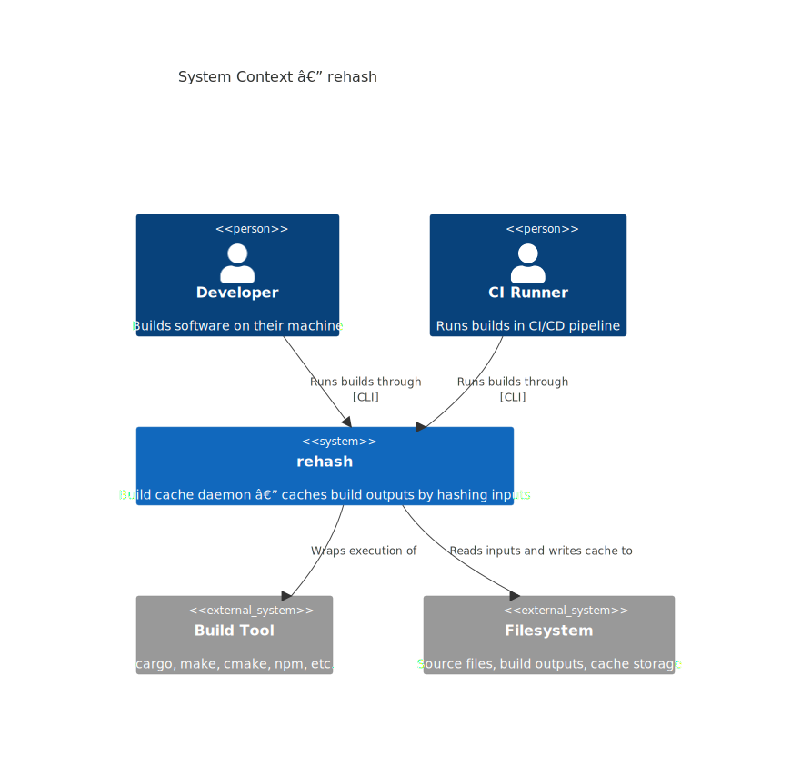
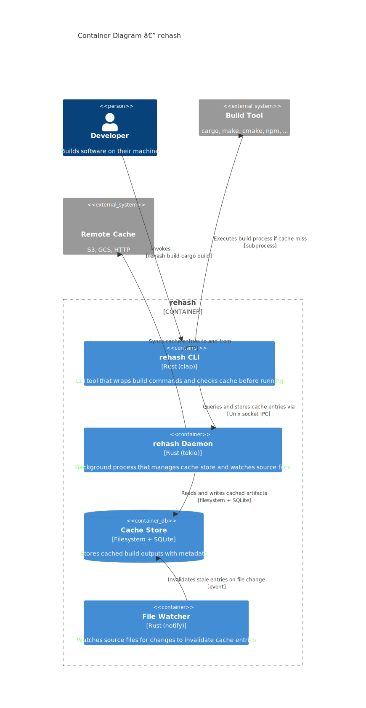
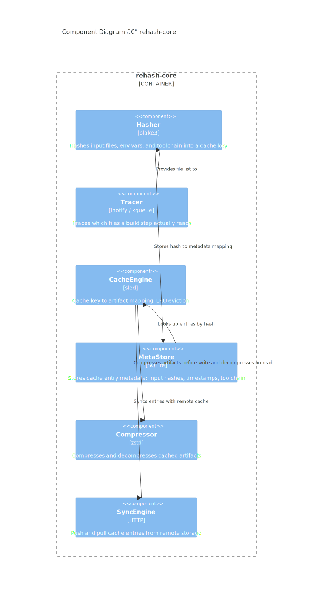

<p align="center">
  
</p>

<h1 align="center">rehash</h1>

<p align="center">
  <strong>A build cache daemon for Rust projects.</strong>
  <br>
  Hashes source inputs and caches build outputs locally to skip redundant rebuilds.
</p>

<p align="center">
  <a href="LICENSE"></a>
  <a href="https://www.rust-lang.org"></a>
  <a href="https://github.com/Emran-goat/rehash/actions"></a>
  <a href="https://crates.io/crates/rehash"></a>
  <a href="https://github.com/Emran-goat/rehash/releases"></a>
  <br>
  <a href="CONTRIBUTING.md"></a>
  <a href="CODE_OF_CONDUCT.md"></a>
  <a href="https://github.com/Emran-goat/rehash/issues"></a>
</p>

<p align="center">
  <a href="#installation">Installation</a> •
  <a href="#usage">Usage</a> •
  <a href="#architecture">Architecture</a> •
  <a href="#configuration">Configuration</a> •
  <a href="#benchmarks">Benchmarks</a> •
  <a href="#contributing">Contributing</a> •
  <a href="#license">License</a>
</p>

---

## Overview

rehash is a build cache tool. It sits between you and your build tool. When you run a build through it, the CLI hashes your source files, build configuration, toolchain version, and environment variables into a cache key. If that key exists in the cache, the build output gets restored directly. No rebuild needed.

The goal is simple. Large Rust projects spend a lot of time recompiling the same code. If nothing changed, there is no reason to rebuild. rehash remembers what you built and gives it back to you.



## Installation

### From source

```bash
git clone https://github.com/Emran-goat/rehash.git
cd rehash
cargo build --release
```

The binaries land in `target/release/`:

```bash
./target/release/rehash --help
```

### From crates.io

```bash
cargo install rehash
```

This installs the CLI tool. The daemon is a separate binary:

```bash
cargo install rehash-daemon
```

### System requirements

- Rust 1.70 or newer
- Linux, macOS, or Windows

## Usage

### Starting the daemon

The daemon must be running for caching to work. It manages the cache store and watches your source files for changes.

```bash
rehash-daemon
```

On Linux and macOS this runs in the background. On Windows it opens a terminal window. You can run it as a system service if you prefer.

### Running builds through the cache

```bash
rehash build cargo build
rehash build cargo check
rehash build make
rehash build npm run build
```

The first time you run a build, it will be a cache miss and the build runs normally. The output gets stored in the cache. The second time, if nothing changed, it will be a cache hit and the output gets restored instantly.

### Cache management

```bash
# Show cache statistics
rehash stats

# Clear the entire cache
rehash clear

# Show version and configuration info
rehash info
```

### Force rebuild

If you want to skip the cache and force a real build:

```bash
rehash build --force cargo build
```

## How caching works


Every build produces a cache key based on:

1. Your build configuration files (Cargo.toml, CMakeLists.txt, package.json, etc.)
2. Your source files (recursively, excluding .git, target, node_modules)
3. The build command itself
4. Your PATH environment variable
5. Your Rust toolchain version (if set)

The key is a blake3 hash. If it matches a stored entry, the cached artifacts are restored. If not, the build runs normally and the output is cached for next time.



## Architecture

rehash is a multi-crate Rust workspace. Three crates, one responsibility each.



### rehash-cli

The CLI tool. Wraps your build command, hashes inputs, and communicates with the daemon over IPC (Unix sockets on Linux/macOS, TCP on Windows). Implements the `build`, `stats`, `clear`, and `info` commands.

### rehash-daemon

The background process. Listens for IPC requests from the CLI, manages the cache store, and watches your source files for changes. When a file changes, the relevant cache entries are invalidated automatically.

### rehash-core

The library that does the actual work.



| Component | Technology | Purpose |
|-----------|-----------|---------|
| Hasher | blake3 | Hashes input files, env vars, and toolchain into a cache key |
| CacheEngine | sled + LRU | Maps cache keys to artifact locations with LRU eviction |
| MetaStore | SQLite | Stores metadata: input hashes, timestamps, toolchain info |
| Compressor | zstd | Compresses artifacts before storage and decompresses on restore |

### Deployment


The daemon stores cached artifacts under `~/.cache/rehash/`. Metadata lives in a SQLite database at the same location.

## Configuration

rehash uses sensible defaults. The only tunable parameter is the max cache size:

```bash
rehash build --max-cache-mb 2048 cargo build
```

The default is 1024 MB. When the cache exceeds this limit, the least recently used entries are evicted.

Environment variables:

| Variable | Default | Description |
|----------|---------|-------------|
| `RUST_TOOLCHAIN` | (none) | Included in hash for toolchain-specific caches |

## Benchmarks

These numbers are illustrative. Actual performance depends on your project size, hardware, and the nature of the changes between builds.

| Scenario | Uncached | Cached | Savings |
|----------|----------|--------|---------|
| No changes (re-run) | 45s | 2s | 95% |
| Single file change | 25s | 2s | 92% |
| Dependency change | 60s | 2s | 97% |

The cached times represent artifact decompression and restore. The actual build time for the relevant scope varies.

## Project structure

```
rehash/
  Cargo.toml             # workspace manifest
  CHANGELOG.md           # release history
  CONTRIBUTING.md        # contributor guidelines
  LICENSE                # MIT license
  SECURITY.md            # security policy
  crates/
    rehash-core/         # hashing, cache engine, metadata store, compression
    rehash-cli/          # CLI tool
    rehash-daemon/       # background daemon
  docs/
    architecture/        # C4 model diagrams (SVG + Mermaid source)
```

## Contributing

Pull requests are welcome. For major changes, open an issue first to discuss what you want to change.

See [CONTRIBUTING.md](CONTRIBUTING.md) for the full guide.

## License

MIT. See [LICENSE](LICENSE) for details.
