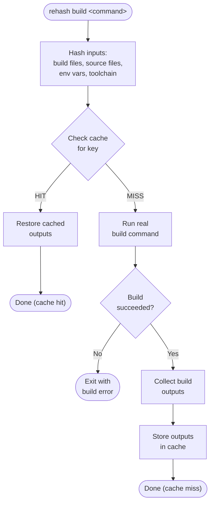

# Build Lifecycle Flow

```mermaid
flowchart TD
    Start(["rehash build &lt;command&gt;"]) --> Hash[Hash inputs:\nbuild files, source files,\nenv vars, toolchain]
    Hash --> Check{Check cache\nfor key}
    Check -->|HIT| Restore[Restore cached\noutputs]
    Restore --> Done(["Done (cache hit)"])
    Check -->|MISS| Run[Run real\nbuild command]
    Run --> Success{Build\nsucceeded?}
    Success -->|No| Exit(["Exit with\nbuild error"])
    Success -->|Yes| Collect[Collect build\noutputs]
    Collect --> Store[Store outputs\nin cache]
    Store --> DoneMiss(["Done (cache miss)"])
```

