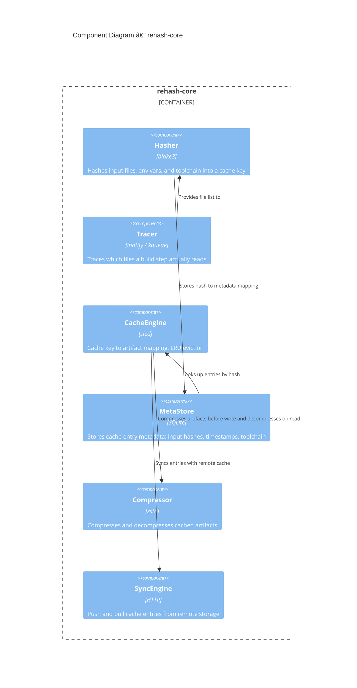

# Component Diagram — rehash-core

```mermaid
C4Component
  title Component Diagram — rehash-core

  Container_Boundary(core, "rehash-core") {
    Component(hash, "Hasher", "blake3", "Hashes input files, env vars, and toolchain into a cache key")
    Component(trace, "Tracer", "inotify / kqueue", "Traces which files a build step actually reads")
    Component(cache, "CacheEngine", "sled", "Cache key to artifact mapping, LRU eviction")
    Component(db, "MetaStore", "SQLite", "Stores cache entry metadata: input hashes, timestamps, toolchain")
    Component(compress, "Compressor", "zstd", "Compresses and decompresses cached artifacts")
    Component(sync, "SyncEngine", "HTTP", "Push and pull cache entries from remote storage")
  }

  Rel(hash, db, "Stores hash to metadata mapping")
  Rel(trace, hash, "Provides file list to")
  Rel(cache, compress, "Compresses artifacts before write and decompresses on read")
  Rel(cache, sync, "Syncs entries with remote cache")
  Rel(db, cache, "Looks up entries by hash")
```

