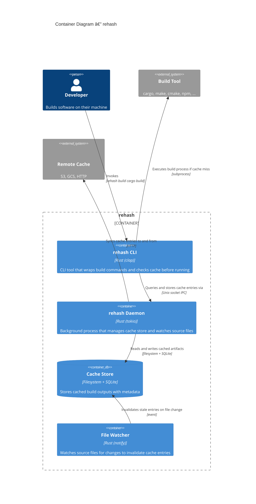

# Container Diagram — rehash

```mermaid
C4Container
  title Container Diagram — rehash

  Person(dev, "Developer", "Builds software on their machine")

  Container_Boundary(rehash, "rehash") {
    Container(cli, "rehash CLI", "Rust (clap)", "CLI tool that wraps build commands and checks cache before running")
    Container(daemon, "rehash Daemon", "Rust (tokio)", "Background process that manages cache store and watches source files")
    ContainerDb(cache, "Cache Store", "Filesystem + SQLite", "Stores cached build outputs with metadata")
    Container(watcher, "File Watcher", "Rust (notify)", "Watches source files for changes to invalidate cache entries")
  }

  System_Ext(buildTool, "Build Tool", "cargo, make, cmake, npm, ...")
  System_Ext(remote, "Remote Cache", "S3, GCS, HTTP", "Optional shared cache for CI")

  Rel(dev, cli, "Invokes", "rehash build cargo build")
  Rel(cli, daemon, "Queries and stores cache entries via", "Unix socket IPC")
  Rel(cli, buildTool, "Executes build process if cache miss", "subprocess")
  Rel(daemon, cache, "Reads and writes cached artifacts", "filesystem + SQLite")
  Rel(watcher, cache, "Invalidates stale entries on file change", "event")
  Rel(daemon, remote, "Syncs cache entries to and from", "HTTP")
```

