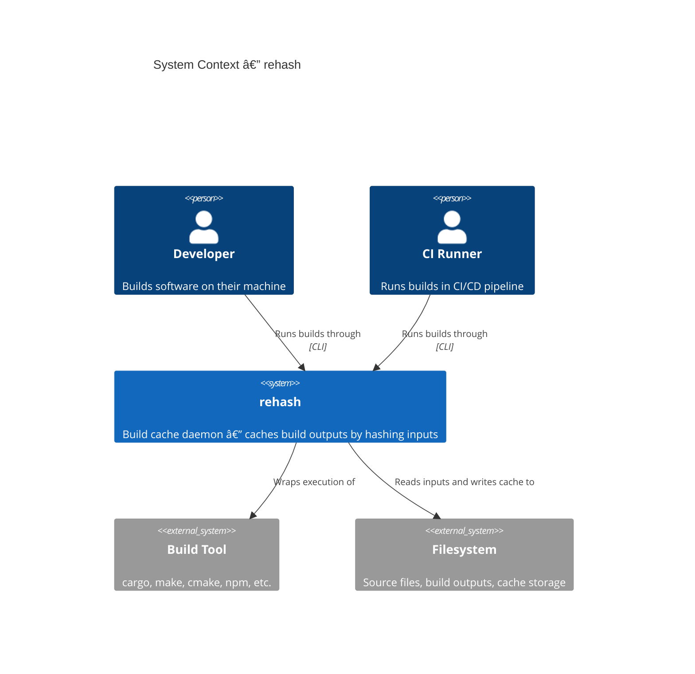

# System Context — rehash

```mermaid
C4Context
  title System Context — rehash

  Person(dev, "Developer", "Builds software on their machine")
  Person(ci, "CI Runner", "Runs builds in CI/CD pipeline")

  System(rehash, "rehash", "Build cache daemon — caches build outputs by hashing inputs")

  System_Ext(buildTool, "Build Tool", "cargo, make, cmake, npm, etc.")
  System_Ext(filesystem, "Filesystem", "Source files, build outputs, cache storage")

  Rel(dev, rehash, "Runs builds through", "CLI")
  Rel(ci, rehash, "Runs builds through", "CLI")
  Rel(rehash, buildTool, "Wraps execution of")
  Rel(rehash, filesystem, "Reads inputs and writes cache to")
```

