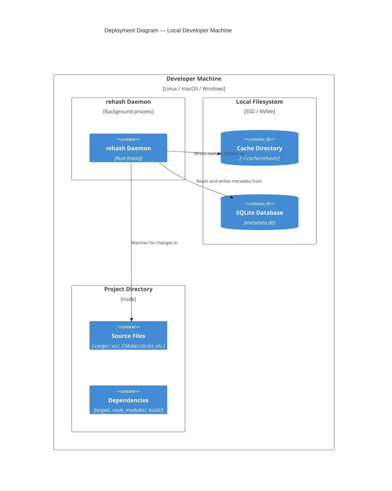
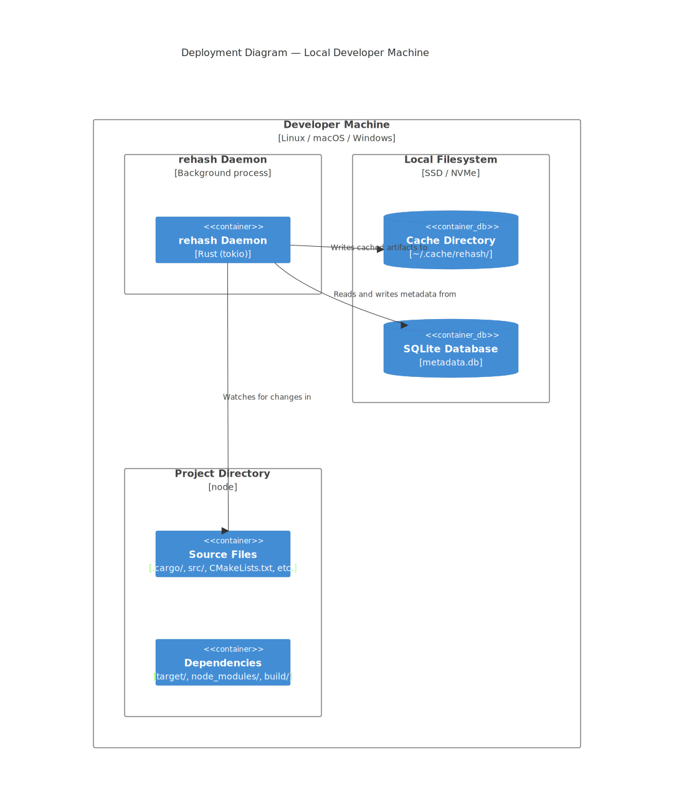

# Deployment Diagram — Local Developer Machine

```mermaid
C4Deployment
  title Deployment Diagram — Local Developer Machine

  Deployment_Node(machine, "Developer Machine", "Linux / macOS / Windows") {
    Deployment_Node(daemonProc, "rehash Daemon", "Background process") {
      Container(daemon, "rehash Daemon", "Rust (tokio)")
    }
    Deployment_Node(fs, "Local Filesystem", "SSD / NVMe") {
      ContainerDb(cacheDir, "Cache Directory", "~/.cache/rehash/")
      ContainerDb(sqlite, "SQLite Database", "metadata.db")
    }
    Deployment_Node(buildDir, "Project Directory") {
      Container(src, "Source Files", ".cargo/, src/, CMakeLists.txt, etc.")
      Container(deps, "Dependencies", "target/, node_modules/, build/")
    }
  }

  Rel(daemon, cacheDir, "Writes cached artifacts to")
  Rel(daemon, sqlite, "Reads and writes metadata from")
  Rel(daemon, src, "Watches for changes in")
```

