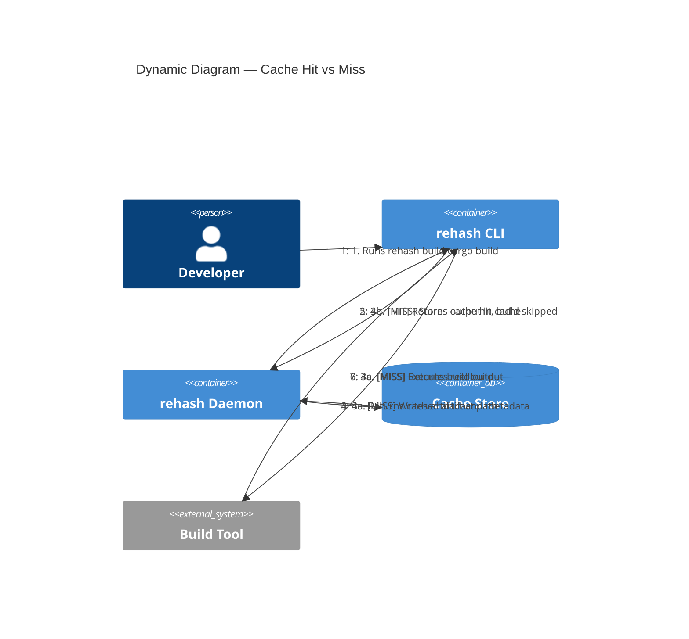
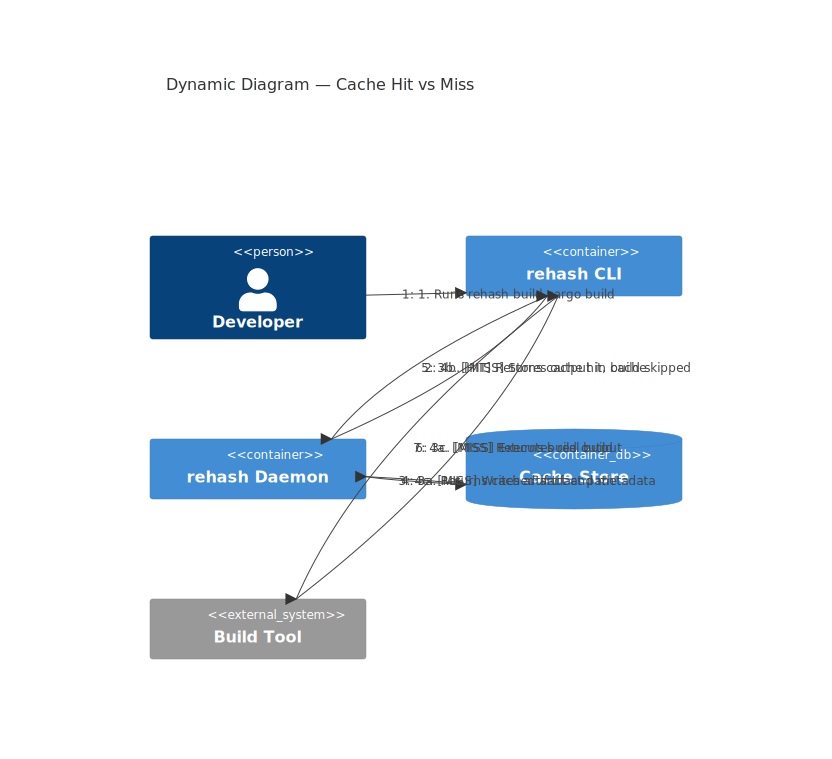

# Dynamic Diagram — Cache Hit vs Miss

```mermaid
C4Dynamic
  title Dynamic Diagram — Cache Hit vs Miss

  Person(dev, "Developer")
  Container(cli, "rehash CLI")
  Container(daemon, "rehash Daemon")
  ContainerDb(cache, "Cache Store")
  System_Ext(build, "Build Tool")

  Rel(dev, cli, "1. Runs rehash build cargo build")
  Rel(cli, daemon, "2a. Queries hash of inputs")
  Rel(daemon, cache, "2b. Looks up hash in cache")
  Rel(cache, daemon, "3a. Returns cached artifact path")
  Rel(daemon, cli, "3b. [HIT] Returns cache hit, build skipped")
  Rel(cli, build, "3c. [MISS] Executes real build")
  Rel(build, cli, "4a. [MISS] Returns build output")
  Rel(cli, daemon, "4b. [MISS] Stores output in cache")
  Rel(daemon, cache, "4c. [MISS] Writes artifact and metadata")
```

